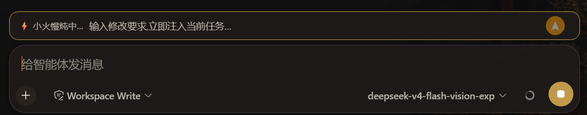

<div align="center">
  <h1>dsh-improved-inline-edit</h1>
  <p><strong>当你的DSH正在工作时，你可以不用停止对话就可以再次提出要求</strong></p>

  [](https://github.com/xiaosurongjia/dsh-improved-inline-edit/stargazers) [](LICENSE) [](https://github.com/xiaosurongjia/dsh-improved-inline-edit/pulls)

  **简体中文（默认）** | [English](README.en.md)
</div>

---

## 目录

- [为什么做这个？](#为什么做这个)
- [界面预览](#界面预览)
- [Deep 短语池](#deep-短语池)
- [特性](#特性)
- [快速开始](#快速开始)
  - [安装](#安装)
  - [使用](#使用)
- [更新内容](#更新内容)
- [技术实现](#技术实现)
- [贡献](#贡献)
- [许可证](#许可证)

---

## 为什么做这个？

在 DSH使用过程中，你是否经历过这种时刻：

> _「等等，方向不对！」「先别动那个，先看看这个！」「这部分改一下再继续！」_

然后只能：
- 干等 agent 跑完 —— 浪费时间
- 粗暴停止对话 —— 丢失进度和上下文

**dsh-improved-inline-edit** 让「中断」和「继续」不再互斥：agent 运行时，composer 上方弹出一条「修改要求」输入条，你随时输入要求发送，消息会通过官方 `agent.steer()` 机制无缝注入到 agent 的下一个决策步骤。

| 现有方案的问题 | 本插件的解决方案 |
|:---|:---|
| 打断 = 丢失上下文 | 通过 `agent.steer()` 无缝注入，上下文完整保留 |
| 只能等任务跑完 | 随时插话，agent 下一步就响应 |
| 界面杂乱 | 仅在运行时弹出，运行结束自动消失 |

---

## 界面预览



---

## Deep 短语池

运行中的状态文案来自一个 **100 条的 Deep 短语池**（借鉴 [dsh-deep-verbs](https://github.com/Winter-And-You-Gone/dsh-deep-verbs) 项目并自由扩充）。洗牌袋抽取保证短期不重复，agent 每推进一步/调用一次工具就轮换下一条；点击状态文案可在中/英之间切换。

| 英文 | 中文 | 含义 |
|:---|:---|:---|
| Deep diving... | 深潜中… | 潜水 |
| Deep seeking... | 深度求索中… | deep seek 动词化 |
| Deep delving... | 刨根问底中… | delve into，深入探究 |
| Deep surfacing... | 喷涂彩虹中… | 潜完上浮换气 |
| Deep breaching... | 跃出海面中… | 鲸跃出水（whale logo 致敬） |
| Deep bubbling... | 海底冒泡中… | 在深海冒泡泡 |
| Deep singing... | 引吭高歌中… | 鲸歌 |
| Deep fishing... | 摸鱼中… | 深度摸鱼 |
| Deep sinking... | 沉底中… | 沉下去慢慢想 |
| Deep sleeping... | 呼呼大睡中… | 睡着了（长思考自嘲） |
| Deep napping... | 偷偷打盹中… | 打盹中（长思考自嘲） |
| Deep dreaming... | 白日做梦中… | 做梦中 |
| Deep cooking... | 小火慢炖中… | let me cook |
| Deep baking... | 烘焙中… | 烘焙 |
| Deep brewing... | 酿造中… | 酿造 |
| Deep caramelizing... | 熬糖色中… | 熬糖色 |
| Deep fermenting... | 发酵中… | 发酵 |
| Deep flambéing... | 喷火炙烤中… | 喷火炙烤 |
| Deep frosting... | 抹奶油中… | 抹奶油 |
| Deep garnishing... | 摆盘中… | 摆盘 |
| Deep julienning... | 切丝中… | 切丝 |
| Deep kneading... | 揉面中… | 揉面 |
| Deep leavening... | 发面中… | 发面 |
| Deep marinating... | 腌制入味中… | 腌制入味 |
| Deep proofing... | 醒面中… | 醒面（面团休息=思考） |
| Deep sautéing... | 爆炒中… | 爆炒 |
| Deep seasoning... | 调味中… | 调味 |
| Deep simmering... | 咕嘟咕嘟中… | 咕嘟冒泡 |
| Deep stewing... | 文火炖煮中… | 文火炖煮 |
| Deep tempering... | 回火中… | 回火 |
| Deep whisking... | 打发中… | 打发 |
| Deep zesting... | 削皮中… | 削皮 |
| Deep spelunking... | 洞窟探秘中… | 探洞 |
| Deep burrowing... | 挖洞中… | 往地底钻 |
| Deep ruminating... | 反刍中… | 反刍式思考 |
| Deep incubating... | 孵化中… | 孵蛋等结果 |
| Deep percolating... | 渗滤中… | 咖啡渗滤 |
| Deep honking... | 哔哔鸣笛中… | 鸣笛 |
| Deep noodling... | 瞎鼓捣中… | 瞎鼓捣 |
| Deep doodling... | 涂鸦中… | 涂鸦开小差 |
| Deep waddling... | 摇摇晃晃中… | 摇摇晃晃 |
| Deep frolicking... | 撒欢中… | 撒欢 |
| Deep moseying... | 溜达中… | 慢悠悠溜达 |
| Deep moonwalking... | 太空步中… | 太空步 |
| Deep photosynthesizing... | 光合作用中… | 光合作用发呆 |
| Deep precipitating... | 沉淀中… | 沉淀 |
| Deep combobulating... | 拼拼凑凑中… | 拼拼凑凑 |
| Deep recombobulating... | 重组中… | 重组 |
| Deep levitating... | 悬空冥想中… | 悬空冥想 |
| Deep metamorphosing... | 蜕变中… | 蜕变 |
| Deep zigzagging... | 蛇皮走位中… | 蛇皮走位 |
| Deep boondoggling... | 瞎忙活中… | 瞎忙活 |
| Deep gallivanting... | 到处浪中… | 到处浪 |
| Deep crafting... | 打磨中… | 打磨 |
| Deep forging... | 锻造中… | 锻造 |
| Deep deliberating... | 斟酌中… | 斟酌 |
| Deep inferring... | 推演中… | 推演 |
| Deep puzzling... | 解谜中… | 解谜 |
| Deep reticulating... | 编织中… | 编织 |
| Deep wandering... | 游弋中… | 游弋 |
| Deep meandering... | 漫步中… | 漫步 |
| Deep orbiting... | 绕飞中… | 绕飞 |
| Deep cascading... | 飞瀑中… | 飞瀑 |
| Deep churning... | 翻腾中… | 翻腾 |
| Deep billowing... | 鼓涌中… | 鼓涌 |
| Deep swirling... | 回旋中… | 回旋 |
| Deep undulating... | 起伏中… | 起伏 |
| Deep fluttering... | 扑棱中… | 扑棱 |
| Deep swooping... | 俯冲中… | 俯冲 |
| Deep shimmying... | 扭摆中… | 扭摆 |
| Deep grooving... | 踩点中… | 踩点 |
| Deep lollygagging... | 磨洋工中… | 磨洋工 |
| Deep sprouting... | 冒芽中… | 冒芽 |
| Deep floating... | 漂浮中… | 漂浮 |
| Deep drifting... | 漂移中… | 漂移 |
| Deep soaring... | 翱翔中… | 翱翔 |
| Deep cruising... | 巡航中… | 巡航 |
| Deep excavating... | 挖掘中… | 挖掘 |
| Deep mapping... | 测绘中… | 测绘 |
| Deep decoding... | 解码中… | 解码 |
| Deep encoding... | 编码中… | 编码 |
| Deep compiling... | 编译中… | 编译 |
| Deep bundling... | 打包中… | 打包 |
| Deep testing... | 测试中… | 测试 |
| Deep refactoring... | 重构中… | 重构 |
| Deep calculating... | 心算中… | 心算 |
| Deep sketching... | 起草中… | 起草 |
| Deep outlining... | 列大纲中… | 列大纲 |
| Deep jamming... | 即兴演奏中… | 即兴演奏 |
| Deep riffing... | 炫技中… | 炫技 |
| Deep brainstorming... | 头脑风暴中… | 头脑风暴 |
| Deep hypothesizing... | 假想中… | 假想 |
| Deep probing... | 探测中… | 探测 |
| Deep scanning... | 扫描中… | 扫描 |
| Deep synthesizing... | 综合提炼中… | 综合提炼 |
| Deep prioritizing... | 排优先级中… | 排优先级 |
| Deep optimizing... | 优化中… | 优化 |
| Deep streamlining... | 精简中… | 精简 |
| Deep hardening... | 加固中… | 加固 |
| Deep shipping... | 发货中… | 发货 |

---

## 特性

| 特性 | 说明 |
|:---|:---|
| **真正的实时打断** | 不是发一条新消息，而是直接注入到**运行中 agent 的下一步决策**（`agent.steer()` 官方机制）|
| **仅运行中显示** | 输入条只在 agent 运行时弹出；运行结束自动消失，**界面零干扰** |
| **输入框自动换行** | textarea 随内容自动增高（上限 140px），长要求不再被截断 |
| **100 条 Deep 短语池** | 运行状态文案随 agent 活动轮换，点击可**中英切换** |
| **完美视觉对齐** | 与底部 composer 同宽、左对齐，三层界面整齐一致 |
| **会「让位」的发送按钮** | 发送后按钮丝滑左移让出 √ 的位置，2 秒后自动回位 |
| **零侵入** | 不改任何 `@deepseek-ai/dsh-*` 源码，卸载干净 |

---

## 快速开始

### 安装

下载本插件到本地，然后运行安装脚本（以 PowerShell 为例）：

```powershell
# 1. 进入插件目录
cd dsh-improved-inline-edit

# 2. 运行安装脚本（会自动探测 profile：desktop 优先，否则 web）
.\install.ps1

# 3. 或者手动指定插件源码目录与目标 profile 目录
.\install.ps1 -PluginSource <插件目录> -ProfileDir <你的 profile 目录>
```

安装脚本会依次完成：

1. **Junction 链接**：把插件包链接到 profile 的 `node_modules`（与其他 dsh 插件同一约定，省空间；无 Junction 权限时自动退化为复制）
2. **注册 patch**：在 profile 的 `cordis.patch.yml` 里追加一行 `insert`，声明插件 ID 与名称
3. **校验解析**：确认 `exports['./client']` 能被 DSH 客户端模块系统解析

> 安装完成后需要**完全重启 DSH**（结束进程，不是关窗口），然后刷新页面。若 DSH 自带窗口，重启即可。

### 使用

1. 让 agent 跑起来（发一条消息）
2. composer 上方出现「修改要求」输入条
3. 输入你的要求（支持多行），按 **Enter** 或点 **➤** 发送
4. agent 会在下一步决策时带上你的要求继续执行

---

## 更新内容

> 按时间与版本号倒序排列（最新的在最上面）。

| 版本 | 日期 | 内容 |
|:---|:---|:---|
| v0.1.6 | 2026.8.28 | 发送按钮与状态区通过 `margin-left: auto` 推到整个输入框最右侧；UI 颜色统一改用 DSH 主题 token（按钮改为品牌色 `brand-primary`），自动适配明/暗主题。 |
| v0.1.5 | 2026.8.28 | 输入框改为 textarea，随内容自动换行增高（上限 140px）；超过上限时显示简约滚动条（6px 窄条 + 圆角滑块）。 |
| v0.1.4 | 2026.8.28 | 修复动态环境下 `setTimeout` 不可用导致的渲染崩溃，改用 Cordis `timer` 服务；按钮改为黄色实心圆钮 + 白色 ➤（旋转 90° 向上），发送后按钮丝滑左移让出 √ 位、2 秒后自动回位。 |
| v0.1.3 | 2026.8.28 | 修复输入条与底部 composer 的左对齐（宽度公式不再额外缩进 dock-inset，内部 `flex + align-items: center` 统一）；按钮图标改为向上的箭头；仅当 agent 运行中（`session.running`）才渲染，运行结束自动消失。 |
| v0.1.2 | 2026.8.28 | 输入条与底部输入框宽度对齐；绿 √ / 红 ✗ 状态显示在按钮右侧并自动消失；发送按钮始终保留，不再被 √ 替换。 |
| v0.1.1 | 2026.8.28 | 接入 dsh-deep-verbs 风格的大短语池（73 条），洗牌袋抽取 + 事件驱动轮换 + 点击中英切换。 |
| v0.1.0 | 2026.8.28 | 首个可发布版本：Agent 运行时 composer 上方弹出「修改要求」输入条，通过 `agent.steer()` 无缝注入修改要求，无需停止对话。 |

---

## 技术实现

```
dsh-improved-inline-edit/
├── index.js             # Host 半部：注册 steer API，调用 agent.steer()
├── client.js            # Client 半部：槽位注入输入条 + 前端交互
├── cordis.patch.yml     # bundle patch 声明
├── install.ps1          # 一键安装脚本
├── assets/preview.png   # 界面预览图
├── LICENSE
└── README.md
```

- **标准 bundle patch**：不改源码，通过 patch 机制注入
- **槽位注入**：利用 DSH 的 slot 系统（`conversation.input.dock`）在 composer 上方插入输入条
- **`agent.steer()`**：通过官方 steering 机制注入修改指令
- **同源 fetch → webServer API**：Client 端 `fetch` 调用 Host 端 `POST /dsh-improved-inline-edit/api/steer`，由 Host 端注入消息

---

## 贡献

欢迎贡献！如果你有想法或发现问题：

1. Fork 本仓库
2. 创建你的特性分支 (`git checkout -b feature/amazing`)
3. 提交你的改动 (`git commit -m 'Add some amazing feature'`)
4. 推送到分支 (`git push origin feature/amazing`)

也欢迎在 [Issues](https://github.com/xiaosurongjia/dsh-improved-inline-edit/issues) 中提出建议或报告 bug。

---

## 许可证

[MIT](LICENSE) © [xiaosurongjia](https://github.com/xiaosurongjia)
